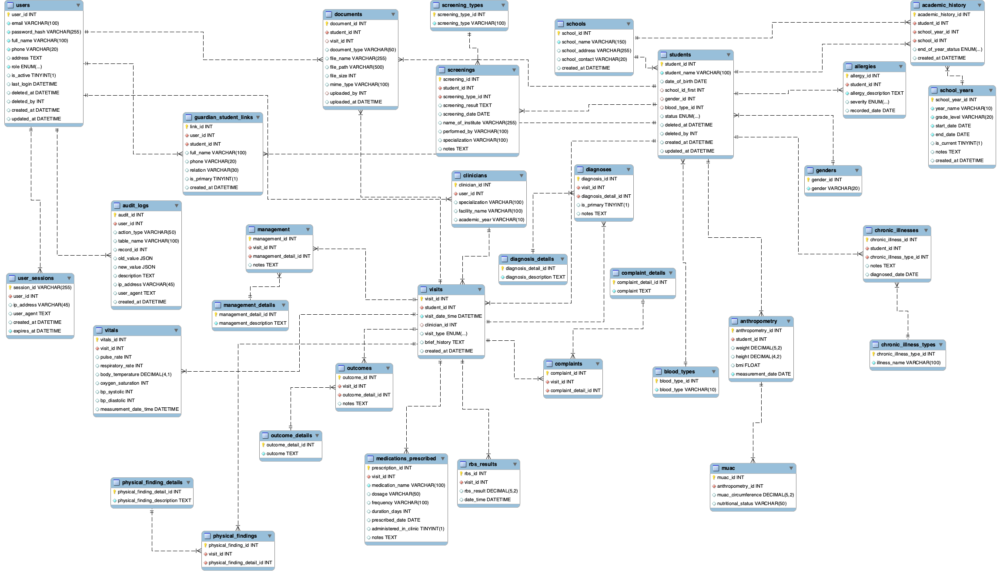

# Database Schema Documentation

## Design Philosophy

The schema was designed with three principles:

1. **Clinical accuracy** — Tables reflect real clinical workflows and capture the patient journey from presentation to outcome
2. **Query efficiency** — Normalized structure with lookup tables for fast aggregation and reporting
3. **Scalability** — Modular design allows new modules (e.g., mental health, dental) to be added without restructuring

---

## Entity Relationship Overview

The database consists of **7 modules** interconnected through two central tables: `students` (identity hub) and `visits` (clinical event hub).

---

### Module 1: Core Student Identity

| Table | Purpose |
|:---|:---|
| `students` | Unique student record — links to all other modules |
| `genders` | Lookup table (Male, Female) |
| `blood_types` | Lookup table (A+, A-, B+, B-, AB+, AB-, O+, O-) |
| `guardian_student_links` | Many-to-many relationship linking students to guardians |

---

### Module 2: Clinical Encounters

The core of the system. Every patient visit is captured here end-to-end.

| Table | Purpose |
|:---|:---|
| `visits` | Each clinical encounter — date, school, clinician, student |
| `vitals` | Temperature, blood pressure, heart rate, respiratory rate |
| `complaints` | Presenting complaints per visit |
| `complaint_details` | Lookup table for standardized complaint types |
| `physical_findings` | Physical examination results per visit |
| `physical_findings_details` | Lookup table for standardized finding types |
| `diagnoses` | Diagnoses assigned per visit |
| `diagnosis_details` | Lookup table for standardized diagnosis codes |
| `management` | Treatment and management plans per visit |
| `management_details` | Lookup table for management categories (conservative, counseling, medication, procedural) |
| `medications_prescribed` | Medications prescribed, including dosage and duration |
| `rbs_results` | Random blood sugar results |
| `outcomes` | Disposition per visit |
| `outcomes_details` | Lookup table (returned to class, sent home, referred) |
| `clinicians` | Reference table for clinical staff |

---

### Module 3: Academic Context

| Table | Purpose |
|:---|:---|
| `schools` | School master list (campus names, locations) |
| `school_years` | Academic year definitions |
| `academic_history` | Student grade and section enrollment per academic year |

---

### Module 4: Nutritional Surveillance

| Table | Purpose |
|:---|:---|
| `anthropometry` | Height, weight, BMI-for-age calculations |
| `muac` | Mid-upper arm circumference — malnutrition screening (SAM/MAM flags) |

---

### Module 5: Student Screenings

| Table | Purpose |
|:---|:---|
| `screenings` | Vision, hearing, dental, and other screenings conducted across the student body |
| `screening_types` | Lookup table for screening categories |

---

### Module 6: Disease Conditions

| Table | Purpose |
|:---|:---|
| `chronic_illnesses` | Student-level chronic condition flags |
| `chronic_illness_types` | Lookup table (asthma, diabetes, epilepsy, sickle cell, etc.) |
| `allergies` | Documented allergies per student |

---

### Module 7: System Administration

| Table | Purpose |
|:---|:---|
| `users` | System user accounts |
| `user_sessions` | Login session tracking |
| `audit_logs` | Data modification tracking for compliance |
| `documents` | Attached files and reports linked to records |

---

## Key Design Decisions

### The `_details` Pattern

Tables like `complaints` + `complaint_details` and `diagnoses` + `diagnosis_details` use a normalized lookup pattern. This allows:

- Multiple complaints/diagnoses per single visit
- Standardized terminology for consistent reporting
- Clean JOIN operations for dashboard queries

### Modular Separation

Screening data is separated from clinical visit data. Why?

- Screenings are school-wide events, not sick visits
- Allows independent analysis of preventive (school-wide screenings) vs. curative (clinic visits) services
- Easier reporting to stakeholders on screening program performance

### Academic Linkage

Linking health data to `academic_history` enables analysis by grade level — critical for:

- Age-appropriate nutritional assessments
- Grade-specific disease prevalence
- School-year trend comparisons

---

## Why This Structure Matters

This schema doesn't just store data — it enables questions:

- *Which school had the highest medication rejection rate this term?*
- *Are MUAC red flags clustering in specific grades?*
- *What are the top 5 diagnoses among students referred to higher care?*
- *Is screening completion improving year-over-year?*

Every table exists to answer a clinical or operational question about the students we serve. Nothing is theoretical.
